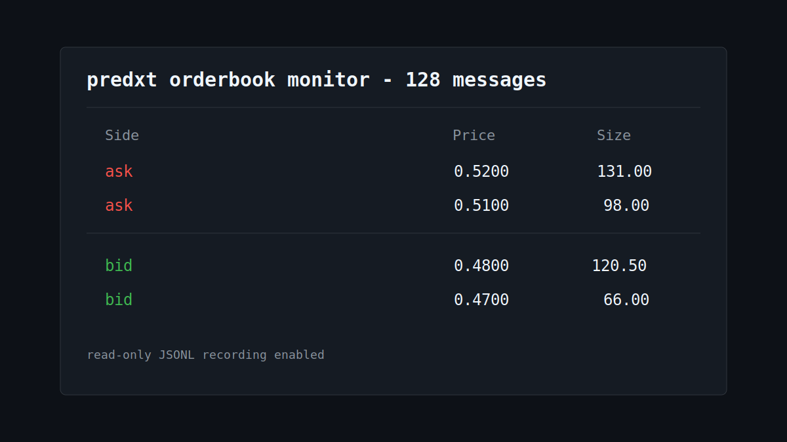

# predxt-orderbook-tui

Read-only terminal orderbook monitor powered by
[`predxt`](https://github.com/hzprotocol/predxt).



This starter shows how to build a small realtime prediction-market instrument
without order placement, account management, or trading advice.

## Quickstart

Polymarket market websockets are public. Use a valid CLOB asset id:

```bash
uv sync
uv run predxt-orderbook-tui polymarket --asset-id 1234567890 --limit 100
```

Record incoming messages as JSONL:

```bash
uv run predxt-orderbook-tui polymarket --asset-id 1234567890 --jsonl out.jsonl
```

Kalshi and Opinion require credentials:

```bash
KALSHI_KEY_ID=... KALSHI_PRIVATE_KEY_PATH=... uv run predxt-orderbook-tui kalshi --market MARKET
OPINION_API_KEY=... uv run predxt-orderbook-tui opinion --market-id 2764
```

## Docker

```bash
docker build -t predxt-orderbook-tui .
docker run --rm -it predxt-orderbook-tui polymarket --asset-id 1234567890
```

## Boundary

This project is read-only. It does not place orders, manage accounts, make
profitability claims, or provide financial advice.
